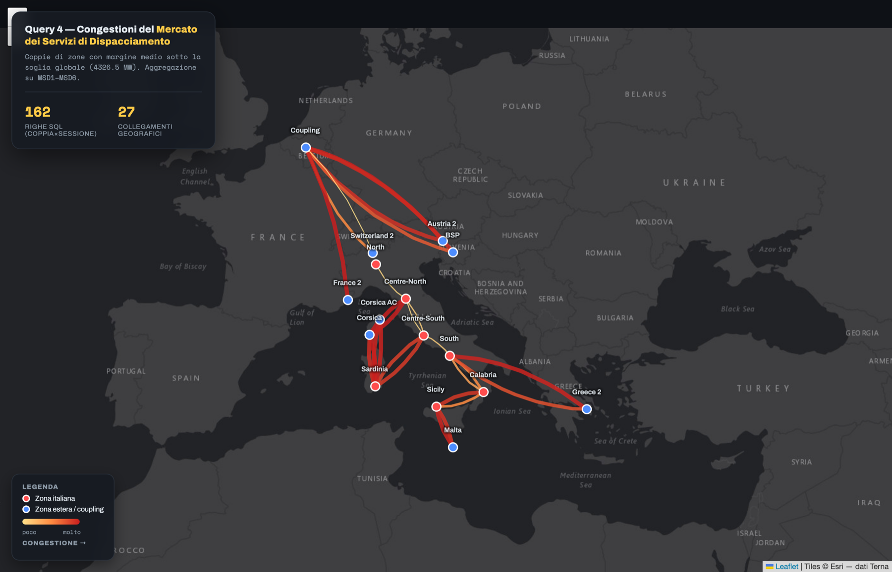

# Italian Electricity System — Relational and NoSQL Data Management

A study of the Italian power system built on **Terna open data**: from raw CSV
exports to a constrained PostgreSQL schema, through query optimization, and then
re-implemented on a document database (MongoDB) and a property-graph database
(Neo4j).

> Course project — **Data Management for Data Science**, MSc in Data Science,
> Sapienza Università di Roma, A.Y. 2025/2026.
> Prof. Domenico Lembo · Prof. Riccardo Rosati.

<p>
  
  
  
  
  
</p>

[](https://ludovicademartino.github.io/terna-electricity-data-management/viz/query04-congestion-map.html)

<p align="center">
  <b><a href="https://ludovicademartino.github.io/terna-electricity-data-management/viz/query04-congestion-map.html">▶ Open the interactive map</a></b><br>
  <sub>Query 4, live: the 27 congested links of the Italian balancing market. Hover any arc for its margin.</sub>
</p>

---

## What the project asks

Ten questions about how electricity is produced, exchanged and balanced across
Italy: **where the demand forecast is least accurate**, **how renewables behave
at peak**, **which foreign exchanges weigh most**, and **where the grid comes
under stress**.

The same ten questions are answered three times over — in SQL, in MongoDB's
aggregation framework, and (for the one question that is really about a network)
in Cypher — which is what makes the comparison between the three data models
concrete rather than theoretical.

---

## The dataset

Ten CSV exports from the [Terna Download Center](https://www.terna.it/en/electric-system/transparency-report/download-center),
covering **January–March 2026**, ~614,000 rows in total.

| Domain | Content | Rows |
| --- | --- | ---: |
| Demand | Load and forecast load per bidding zone, 15-min | 19,202 |
| Generation | Actual generation by primary source | 14,402 |
| Transmission | Cross-border import/export and scheduled balance | 19,202 |
| Day-ahead market (MGP) | Forecast transit limits between zones | 29,570 |
| Intra-day market (MI) | Transit limits, sessions CRIDA1–3 | 67,058 |
| Balancing market (MSD) | Margins, sessions MSD1–6 | 375,234 |
| Balancing market input | Forecast load per session | 61,042 |
| Adequacy (actual) | Available capacity by macroarea and fuel | 6,050 |
| Adequacy (forecast) | Forecast capacity per macro-user | 22,292 |
| Connections | RES grid-connection requests by region | 67 |

The CSVs are not tracked here — see [`data/README.md`](data/README.md) for how
to download and load them.

---

## What the data says

Four things came out of the ten queries.

**The forecast is equally good everywhere — the ranking measures zone size, not
difficulty.** In absolute terms North looks far and away the hardest zone to
predict: a mean absolute error of 281 MW against Sardinia's 12 MW. Measured
against the load each zone actually carries, the spread collapses — **every one
of the seven zones sits between 1.34% and 1.37%**. North is not harder to
forecast, it is twenty times larger. Query 1 ranks by absolute error, so it
surfaces size before difficulty; worth knowing before reading its output as a
quality ranking.

| Zone | Mean abs. error | Mean load | Relative |
| --- | ---: | ---: | ---: |
| Centre-South | 81 MW | 5,951 MW | 1.37% |
| Centre-North | 40 MW | 2,909 MW | 1.37% |
| Sicily | 29 MW | 2,127 MW | 1.36% |
| North | 281 MW | 20,623 MW | 1.36% |
| Sardinia | 12 MW | 902 MW | 1.36% |
| Calabria | 12 MW | 880 MW | 1.35% |
| South | 31 MW | 2,352 MW | 1.34% |

**Two borders carry the imports.** In the hours when a country imports above its
own average, France averages 3,927 MW (peak 4,615) and Switzerland 3,441 MW
(peak 4,481). Slovenia, Montenegro, Greece and Austria are all under 630 MW — an
order of magnitude down. Italy's import exposure is concentrated on the
north-western frontier.

**Congestion sits on the thin cables, not on the backbone.** Of the 27 congested
links, the 17 that cross a sea or a border have a median margin of **115 MW**;
the 10 mainland links have **2,128 MW** — eighteen times wider, and only
marginally under the 4,326.5 MW threshold. The tightest of all are
Centre-North↔Corsica (2.3 MW) and Sardinia–Corsica (25 MW). In Neo4j the same
result shows up as structure rather than as numbers: the congested network
splits into two components, with the islands forming their own cluster.

**And the renewable queue sits behind exactly those cables.** Of the 195 GW of
connection capacity that never reached a contract, **86% is in the South and the
islands** — Puglia alone accounts for 55 GW across 589 applications, Sardinia
for 43 GW, Sicily for 34 GW. Read next to the previous finding, the two queries
tell one story: **the regions with the most renewable capacity waiting to
connect are the ones behind the weakest links in the grid.**

| Region | Capacity never contracted | Applications |
| --- | ---: | ---: |
| Puglia | 54,628 MW | 589 |
| Sardinia | 42,544 MW | 599 |
| Sicily | 34,047 MW | 332 |
| Basilicata | 19,815 MW | 662 |

---

## Repository layout

```
├── sql/                            PostgreSQL — Homework 1 & 2
│   ├── 01_raw_schema.sql               landing layer, one TEXT table per CSV
│   ├── 02_clean_schema.sql             typed schema with keys and CHECK constraints
│   ├── 03_dimensions_and_constraints.sql   zone/source dimensions + foreign keys
│   ├── 04_queries.sql                  the ten analytical queries
│   └── 05_optimizations.sql            the four slow queries, made fast
├── nosql/
│   ├── mongodb/                    Document model — Homework 3
│   │   ├── 01_transform_collections.js     CSV headers → clean schema, native dates
│   │   ├── 02_reference_collections.js     zone and source collections
│   │   ├── 03_indexes.js                   the two indexes the pipelines need
│   │   └── 04_queries.js                   all ten queries as aggregation pipelines
│   └── neo4j/                      Graph model — Homework 3
│       └── query04_msd_graph.cypher        Query 4 rebuilt as a network of zones
├── viz/
│   └── query04-congestion-map.html     the congested links, drawn on a real map
├── docs/
│   ├── images/query04-congestion-map.png   the screenshot above
│   ├── homework-1-2-presentation.pdf
│   ├── homework-3-presentation.pdf
│   └── homework-3-report.docx
└── data/                           (empty — see data/README.md)
```

---

## Part 1 — Relational design

A two-layer pipeline, because the CSVs are dirty and the constraints are the
point:

1. **`raw`** — one table per export, every column `TEXT`. The only goal is to
   ingest the files without a parse error.
2. **`clean`** — rebuilt with real types (`TIMESTAMP`, `NUMERIC`), `NOT NULL`,
   `CHECK` constraints on non-negative quantities and on the enumerated session
   codes (`CRIDA1–3`, `MSD1–6`), and a composite primary key per fact
   (`date, zone, session`). The `Applied filters …` footer row that Terna
   appends to every export is dropped here.
3. **Dimensions** — `clean.zone` (Italian/foreign, elementary/aggregate) and
   `clean.source` (renewable flag) turn free-text labels into a controlled
   vocabulary, and every fact table gets a foreign key into them.

The rationale: the raw layer absorbs dirty input; the clean layer turns types,
domains and identifiers into constraints the DBMS can actually use for joins,
keys and query plans.

### The ten queries

Between them they cover the full range of SQL required by the course — joins,
aggregation, `GROUP BY`/`HAVING`, scalar and correlated sub-queries, negated
sub-queries, derived tables and `UNION`.

| # | Question | Notable construct |
| --- | --- | --- |
| 1 | Daily forecast error per zone, above the overall mean | `HAVING` + scalar sub-query |
| 2 | Renewable output during high-load hours | join + `IN` sub-query |
| 3 | Countries with a net import balance | **correlated** sub-query |
| 4 | MSD margins against forecast load | join on a composite key |
| 5 | Below-average capacity per macroarea | derived table |
| 6 | North vs South-and-Islands | `UNION` of two aggregates |
| 7 | Connection requests never reaching a contract | `NOT EXISTS` |
| 8 | Renewables on daily peak hours | correlated sub-query on the day |
| 9 | MSD6 margins not covered by intra-day limits | `NOT EXISTS` anti-join |
| 10 | Generation during critical forecast hours | doubly nested correlation |

---

## Part 2 — Evaluation and optimization

Four queries put real pressure on the planner. Runtimes measured with
`EXPLAIN ANALYZE` on the dataset above:

| Query | Bottleneck | Technique | Slow | Fast |
| --- | --- | --- | ---: | ---: |
| **Q3** | Correlated `AVG` per country — the inner query runs once per outer tuple | Materialized view + index on the join column | 9.7 s | **15 ms** |
| **Q8** | Correlated daily `AVG`, and `DATE(date)` on both sides blocking any index | Precomputed daily-average table + stored `date_only` column + indexes | 2.9 s | **19 ms** |
| **Q9** | `NOT EXISTS` anti-join rescanning 67k intra-day rows, cost ~`B(D+RC)` | Composite B+-tree indexes matching the predicate, cost `D·log₂B` | 1.3 s | **958 ms** |
| **Q10** | Two levels of correlation — an average recomputed inside an `EXISTS` | The critical timestamps don't depend on the outer row: materialize + index | 172 ms | **13 ms** |

Three levers, in short: **indexes**, **materialization**, and **rewriting the
query without changing its meaning**. Q9 is the honest case — an anti-join that
indexes improve but do not transform.

See [`sql/05_optimizations.sql`](sql/05_optimizations.sql); the teardown block at
the end drops the auxiliary structures, which is how the slow and fast plans were
shown side by side during the presentation.

---

## Part 3 — NoSQL

### MongoDB — the document model

Twelve collections, one per CSV plus the two reference collections. Same shape as
the relational schema, with one honest difference: **nothing is enforced**. The
primary key is the automatic `_id` (`ObjectId`), the composite keys are gone, and
there are no foreign keys — links happen at query time with `$lookup`, only when
a query needs them.

All ten queries were reproduced and verified to return the same results. Two
patterns recur:

- **Scalar sub-queries have no equivalent.** The global average used in a `HAVING`
  is computed first into a JavaScript variable, then injected into the pipeline.
- **Derived tables become collections.** What SQL expresses as one nested
  statement, Mongo spells out as explicit steps: a small precomputed collection
  written with `$out`, joined back with `$lookup`.

That is the real finding. Where Postgres optimizes one declarative statement, in
Mongo the decomposition is the programmer's job.

### Neo4j — the graph model

Query 4 is about **pairs of connected zones** — source, target, margin. That is a
graph, not a table. Zones become nodes, each margin becomes a relationship, and
the join plus `GROUP BY` becomes a network of `MSD_LINK` edges with a `congested`
flag.

Oracle Spatial was considered first, since Query 4 is geographic in spirit, but it
needs exact coordinates for every zone — which Terna's dataset does not provide
and which could not be reliably attributed to the Italian bidding zones and the
foreign borders involved. Neo4j models the same query without them.

**162 congested links — identical in SQL, MongoDB and Neo4j.**

### The map

**[Open it live →](%s)**

[`viz/query04-congestion-map.html`](viz/query04-congestion-map.html) is a
self-contained Leaflet page that draws the congested flows of Query 4 on a real
map of Italy and its borders. Arcs are curved so that A→B stays distinguishable
from B→A, and coloured by congestion intensity; hovering one shows its average
margin and forecast load.

It is served from this repository through GitHub Pages, and also runs by simply
opening the file in any browser — no server, no build step.

---

## Reproducing it

**Prerequisites** — PostgreSQL 14+, MongoDB 6+ with `mongosh`, Neo4j 5+
(only for Query 4), and the CSVs in `data/` (see [`data/README.md`](data/README.md)).

```bash
# 1. Relational pipeline
createdb terna
psql -d terna -f sql/01_raw_schema.sql
#    ... load the CSVs into the raw tables, see data/README.md ...
psql -d terna -f sql/02_clean_schema.sql
psql -d terna -f sql/03_dimensions_and_constraints.sql
psql -d terna -f sql/04_queries.sql
psql -d terna -f sql/05_optimizations.sql
```

```bash
# 2. Document model — after importing each CSV as its own collection
mongosh terna nosql/mongodb/01_transform_collections.js
mongosh terna nosql/mongodb/02_reference_collections.js
mongosh terna nosql/mongodb/03_indexes.js
mongosh terna nosql/mongodb/04_queries.js
```

For the graph model, copy the two MSD exports into the Neo4j `import` directory
and run [`nosql/neo4j/query04_msd_graph.cypher`](nosql/neo4j/query04_msd_graph.cypher)
in Neo4j Browser, one block at a time.

---

## Authors

**Group 35** — Data Management for Data Science, 2025/2026

- Ludovica de Martino
- Matteo Giganti

## License

Code released under the [MIT License](LICENSE).

The underlying data is published by [Terna S.p.A.](https://www.terna.it) through
its Download Center and remains subject to Terna's own terms of use; it is not
redistributed here.
